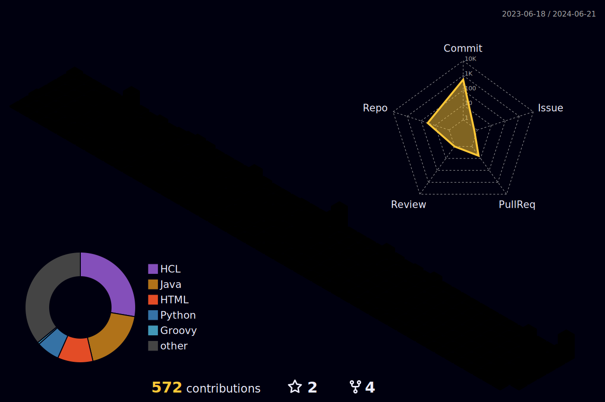

<!--    Üs foto  Burayi olusturunca yaparsin-->

<!-- ##  -->
<b> Languages and Tools:</b>

  
  
  <!--  -->
  
  
  
  
    
  
  
  
  <!--  -->
  
  
  
  
  
  
  

   

<!-- 
<a href="https://www.python.org/" target="_blank" rel="noreferrer"> 

 <a href="https://www.w3.org/html/" target="_blank" rel="noreferrer">

 

<a href="https://www.mysql.com/" target="_blank" rel="noreferrer">
<a href="https://www.selenium.dev/" target="_blank" rel="noreferrer"> 
  -->
  

<!--  -->

 </a>
      <!--renkli cizgi kismi--> 

<!--    -->

<!-- --> 
 

<!--  -->

<!--    Proilimize gelen insan sayisi

      %e2%9c%a8  yazidaki sembolleri temsil ediyor  link https://www.utf8-chartable.de/unicode-utf8-table.pl?start=128000
 

 -->
<!-- gif koymak yerini belirlemek
 -->

<!-- <h3 align="left">&nbsp; A passionate Web3 developer from Türkiye</h3>  bunu sadece su yer belirleme kodu icin tutuyorum -->  

                                                                   
<!--   Bu istatistik gösteriyor ama nerenin bilmiyorum-->

<!-- <h3 align="center">Connect with me:</h3>

  

 -->

<!--

  
:zap: GitHub Stats
 
-->
<!-- # 💻 Languages and Tools:

 -->

  <!-- 
<h2>📸 My Latest YouTube Videos</h2>
 -->

<!-- BEGIN YOUTUBE-CARDS  Bu kisim Youtube icin yapilmis  -->
<!-- 

[ Looks Like?")](https://www.youtube.com/watch?v=PANX3XgEbYU)

 -->
<!-- END YOUTUBE-CARDS -->

<!-- <picture>           bu kisik yilan toplama meselesi                                            
  <source media="(prefers-color-scheme: dark)" srcset="https://raw.githubusercontent.com/CagatayAkkas/CagatayAkkas/output/github-contribution-grid-snake-dark.svg">
  <source media="(prefers-color-scheme: light)" srcset="https://raw.githubusercontent.com/CagatayAkkas/CagatayAkkas/output/github-contribution-grid-snake.svg">
  
</picture> -->

<!-- # Github Stats      otolari bu repodan cekiyor bunlari kendi repomuz koyum oradan cekebiliriz -->

   
 

  
  
  
  
  

  

  

 
<!-- 

  

 -->
 

<!-- 

  

 -->
 

  

  
  
<!-- 

  

 -->
 

 

 

 

<!--

-->

<!--

   
:zap: Languages and Tools

 -->

<!--  -->

<!--  -->

<!--  

        kirmizi alanda yazi geciyor
 
  görüntüleme sayisi -->

<!-- <h2 align="center">   cizgi eklemek icin -->
<!-- </h2>  -->

<!-- Coder Uncle Pic               Burasi bir gif

 -->

<!-- yorum satiri
<h2 dir="auto"><a id="user-content-necktie-about-me" class="anchor" aria-hidden="true" href="#necktie-about-me"><svg class="octicon octicon-link" viewBox="0 0 16 16" version="1.1" width="16" height="16" aria-hidden="true"><path fill-rule="evenodd" d="M7.775 3.275a.75.75 0 001.06 1.06l1.25-1.25a2 2 0 112.83 2.83l-2.5 2.5a2 2 0 01-2.83 0 .75.75 0 00-1.06 1.06 3.5 3.5 0 004.95 0l2.5-2.5a3.5 3.5 0 00-4.95-4.95l-1.25 1.25zm-4.69 9.64a2 2 0 010-2.83l2.5-2.5a2 2 0 012.83 0 .75.75 0 001.06-1.06 3.5 3.5 0 00-4.95 0l-2.5 2.5a3.5 3.5 0 004.95 4.95l1.25-1.25a.75.75 0 00-1.06-1.06l-1.25 1.25a2 2 0 01-2.83 0z">

### </path></svg></a> About Me ✅ </h2>
-->

<!-- 
<a href="https://discord.gg/hanzelkaraagac">
<strong> Click here to join our Discord server ⬅️ </a> -->

<!-- %7C -> alttaki yaziya | eklememize yariyor  yüzde isareti isaret icin-->
<!--  -->
<!--   
<h3 align="left">Skills: Java | Selenium | JUnit | TestNG | Cucumber | Git - GitHub | Html - Css | JIRA | PostgreSQL | LAMBDA | JDBC | API | </h3>
 -->

 

 <!-- 
 

  
  
  
  
  
   -->
  <!-- 

 -->

 
<!--   üc boyutlu  -->   

<!--     yilanin oldugu kisim -->

<!--  -->

 <!--  -->
 
<!-- ##  <b>My Stats</b>

  
  
  

 -->
<!--  -->

<!--  -->

<!-- ## 🌐 Socials:
 
  -->

<!-- # 💻 Tech Stack:
                -->

<!-- # 📊 GitHub Stats:
 
 
 -->

<!-- ## 🏆 GitHub Trophies
 -->

<!-- ### ✍️ Random Dev Quote

### 🔝 Top Contributed Repo
 -->

<!--  Bu ziyaretci sayisi sanirim-->

<!-- Proudly created with GPRM ( https://gprm.itsvg.in ) -->

<!-- ### Hi there 👋, my name is Ahmet Aksoy
#### DevOps Engineer

With about 2 years of experience in DevOps, I am open-minded and passionate about automating IT processes. I am particularly passionate about developing and implementing effective Continuous Integration and Delivery (CI/CD) pipelines. I rely on best practices such as containerisation, orchestration, monitoring, infrastructure automation tools, as well as configuration management tools, cloud solutions and a desire to learn new technologies.

Skills: AWS | Kubernetes | Docker | Python | Jenkins | Ansible | Terraform  | GitHub | Linux | Azure | Argocd |

- 🔭 I’m currently working on this page. 
- 🌱 I’m currently learning asdasdasdasd 
- 👯 I’m looking to collaborate on adasda 
- 🤔 I’m looking for help with asdadasd 
- 💬 Ask me about adadasd 
- 📫 How to reach me: asdasda 
- 😄 Pronouns: asdasdas 
- ⚡ Fun fact: asdasdad  -->

<!-- 

 -->

<!-- 

  <h2 style="text-align: left;">Social Media</h2>
  
  
  
  
  

 -->

  <table>
    <tr>
      <td style="text-align: left; width: 33%;">
        <h2>Social Media</h2>
      </td>
      <td style="text-align: center; width: 67%;">
        
        
        
        
        <!--  -->
      </td>
    </tr>
  </table>

  <table>
    <tr>      
      <td style="text-align: left; width: 33%;">
        <h2>Live Projects:</h2>
      </td>
      <td style="text-align: center; width: 67%;">
        
        
        
        
        
      </td>
    </tr>
  </table>

<!--   

  -->

<!-- 

  

   -->

<!-- Bu Kisim ilk bastaki sekilde>

<!-- <h1 align="center">Hi 👋, I'm Ahmet Aksoy</h1>
<h3 align="center">Devops Engineer</h3>

  

- 🌱 I’m currently learning **Docker**

<h3 align="left">Connect with me:</h3>

<h3 align="left">Languages and Tools:</h3>

                
 -->

